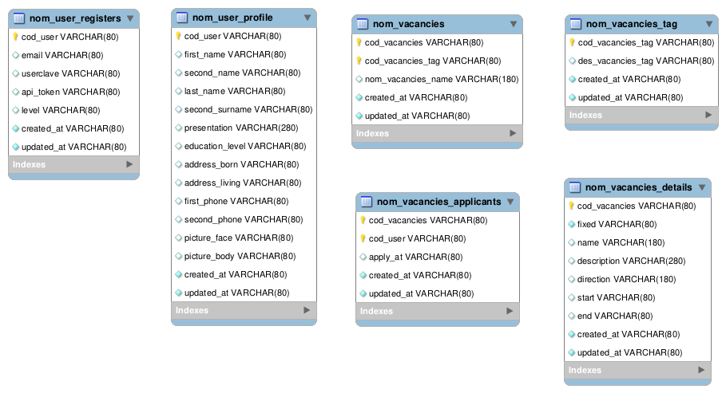

Is a model–view–controller (MVC) application, providing default structures 
for a database, a web service, and web pages templates.

Data is made using ORM model approach, but you can find a minimal Workbench desing [applicantsdb.mwb](applicantsdb.mwb)
only for informational purposes. For better understanding you must check `db/schema.rb`.



For main info check [README.md](README.md)

## Roadmap

- [ ] Starting with DB schema ( 20230619 )
    - [ ] Database schema: [applicantsdb.png](applicantsdb.png)
    - [ ] Database Dictionary [applicantsdb.sql](applicantsdb.sql)
- [ ] Web desing of the frontend ( 20230622 )
    - [ ] fitmap file [applicants.fig](applicants.)
- [ ] Deploy and configuration of environment (20230623)
    - [ ] cretion of the spp
    - [ ] Minimal structure of the controllers and routes
    - [ ] implementations of the DB
- [ ] Definition of the user cases (20230627)
    - [ ] Workflow
    - [ ] User cases of manager
    - [ ] User cases of participants
- [ ] Deploy
    - [ ] Documentation of deploy
    - [ ] Professional deploy with reverse proxy

### Setup development environment

This system is **web targeted, you must setup Ruby on Rails** for and a database 
of course.. SQLite can be but its better Percona-mySQL or PostgreSQL

This desing of **SQL schema is made using ORM into rails**, you can avoid this 
step but must be in sync with. MysqlWorkbench is not available in all operating 
systems but a file with schema its provided for reference.

The design of the **web interface is made in figmap**, you must import the fig 
file, have a gitmap account and have figmap installed.

##### Requirements

* sistema linux soportado, si no usa las versiones exactas no funcionara:
    * Debian: 7, 8, 9; 
    * Buntu 17, 18, 19, 20; 
    * VenenuX 8, 9, 11, 12;
    * Devuan 1, 2, 5
    * Alpine 3.16, 3.17, 3.18
* crear un usuario general y usar este como el usuario principal en su pc de desarrollo
* git (manejador de repositorio y proyecto) 
    * Deb `apt install git git-core`
    * APK `apk add git git-bash-completion git-doc`
* mysql (manejador y servidor DB que hara de pivote)
    * DEB `apt install mysql-client mysql-server` (no hacer si tiene percona)
    * APK `apk add mysql mysql-client mariadb-doc mariadb-server-utils`
* odbc, myodbc, freetds (coneccion DB mysql, ODBC para sybase y mssql)
    * DEB `apt install tdsodbc unixodbc`
    * APK `apk add freetds unixodbc`
* geany (editor para manejo php asi como ver el preview):
    * DEB `apt install geany geany-plugin-treebrowser geany-plugin-addons`
    * APK `apk add geany geany-plugins-treebrowser geany-plugins-addons`
* lighttpd (webserver unicamente para el reverso proxy) 
    * DEB `apt install lighttpd`
    * APK `apk add lighttpd`
* php (interprete)
    * DEB `apt install php-cgi php-mysql php-odbc php-gd php-mcrypt php-curl`
    * APK `apk add php81-cgi php81-mysqlnd php81-odbc php81-gd php81-curl `
* curl (invocar urls) 
    * DEB `apt install curl`
    * APK `apk add curl`

Se recomienda usar mysql-workbench con `apt-get install mysql-workbench` para carga y trabajo con data sql.

* **NOTA 1**: mysqlworkbench solo esta en debian 7,8 y 9, buntu 16,17,18,10. En debian 10/11 usar repos viejos
* **NOTA 2**: php5 solo esta en debian 7,8 por ende usar repos venenux, devuan usar repos tdenetworks
* **NOTA 3**: se asume que en su mysql su usuario root tiene clave root, sino coloque la clave
* **NOTA 4**: debe tener su maquina en linux usando el documento de https://proyectos.tijerazo.net/soporte/manuales-maquinas-linux

##### instalation

TODO

##### Get the project sources

This project uses git management:

```
mkdir -p ~/Devel/

git clone --recursive https://codeberg.org/codeigniter/codeigniter-applicants ~/Devel/codeigniter-applicants

cd ~/Devel/codeigniter-applicants && yarn install
```

> **Warning:** yarn extra step is not necesary for api

Now start to edit the files inside the project.

#### Profiler and debugging

Debugging is using our profiler, it requires a special view which is now part of 
the project so it is provided as an extra file in the `application/views` directory

It can be simply disabled in the controller constructor, but can also autodetected 
if must need by using ENV_DEVEL or ENV_PROD, if ENV_PROD is present.. production 
mode will be active and profiler debbuger will be disabled!

### WORKING WITH FILES

TODO

Submodules were add with:

```
git submodule add -f -b codeigniter2 https://gitlab.com/codeigniterpower/codeigniterpower vendor/codeigniter2

git submodule add -f -b master https://gitlab.com/codeigniterpower/codeigniterpower vendor/codeigniter3
```

## Contributing

State if you are open to contributions and what your requirements are for accepting them.

For people who want to make changes to your project, it's helpful to have some documentation on how to get started. Perhaps there is a script that they should run or some environment variables that they need to set. Make these steps explicit. These instructions could also be useful to your future self.

You can also document commands to lint the code or run tests. These steps help to ensure high code quality and reduce the likelihood that the changes inadvertently break something. Having instructions for running tests is especially helpful if it requires external setup, such as starting a Selenium server for testing in a browser.

