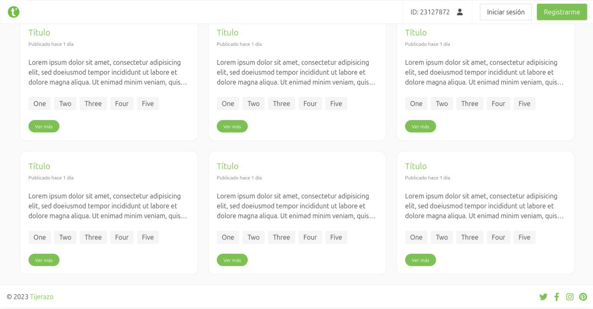
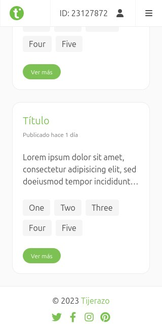

# Applicants

Recruitment application.

## Getting started

If you want to isntall and deploy to test/use this application, please read directly [DEPLOY-INSTALL.md](DEPLOY-INSTALL.md)

If you want to develop/improve and contribute to the application, please read directly [DEVELOPMENT.md](DEVELOPMENT.md)

Already a pro? Just clone and setup your own.

## About this system

This is a **simple recruitment** application

#### Usage

The application employs a database for minimal data storage, internally, it permits to participants to upload information and store until a manager watched it.

Easyle, once deployed the future employee just get into, check a quick list of vacancies, 
then click or touch one and push on the postulate button, fill the fields with personal non-sensible data, 
and later wait for response based on such data.

At the mnager side, just check the list of people that already fill such info, and mark what are 
usefully for work or not, later can bypass the data and create new vacancies.

### Database dictionary

Could be found at the file [applicantsdb.sql](applicantsdb.sql)
but you can find a minimal Workbench desing [applicantsdb.mwb](applicantsdb.mwb)

## LICENSE

CC-BY-NC-SA
